# Mouse Studio — Technical Design Document (TDD)

**Project:** Mouse Studio — a generic, open-source native macOS mouse automation platform
**Status:** Design (pre-implementation)
**Version:** 1.0 (MVP)
**Target platform:** macOS Sequoia, Apple Silicon
**Language:** Swift 5.9+ / SwiftUI
**License:** MIT

> Mouse Studio turns any generic gaming/office mouse into a productivity mouse (MX Master class)
> by resolving rich gestures (single / double / long / chord / chord-scroll) from a small set of
> physical buttons and mapping them to fully configurable actions. GM100 is one supported device
> profile, not a hardcoded target.

---

## Table of Contents

1. [Goals & Non-Goals](#1-goals--non-goals)
2. [High-Level Architecture](#2-high-level-architecture)
3. [Module Dependency Diagram](#3-module-dependency-diagram)
4. [Folder Responsibilities](#4-folder-responsibilities)
5. [Class Diagrams](#5-class-diagrams)
6. [Event Flow Diagrams](#6-event-flow-diagrams)
7. [Sequence Diagrams](#7-sequence-diagrams)
8. [State Machine Diagrams](#8-state-machine-diagrams)
9. [JSON Schema Definitions](#9-json-schema-definitions)
10. [API Contracts](#10-api-contracts)
11. [Threading Model](#11-threading-model)
12. [Accessibility Permissions Flow](#12-accessibility-permissions-flow)
13. [Security Considerations](#13-security-considerations)
14. [Performance Considerations](#14-performance-considerations)
15. [Error Handling Strategy](#15-error-handling-strategy)
16. [Testing Strategy](#16-testing-strategy)
17. [Extensibility Points (post-MVP)](#17-extensibility-points-post-mvp)
18. [Open Questions](#18-open-questions)

---

## 1. Goals & Non-Goals

### 1.1 Goals (MVP)
- Native Swift automation engine with a background service.
- Event-driven engine (no polling, no busy loops); target dispatch latency **< 5 ms**.
- Config-driven rule engine — **zero hardcoded shortcuts**. Every trigger, condition, and action comes from JSON.
- Device-profile abstraction — GM100 is one JSON profile; unknown mice fall back to generic profiles.
- SwiftUI GUI: visual rule editor (no code), Live Mouse Tester with "Detect Mouse", profiles, import/export, logs.
- Clean separation: `MouseStudioCore` has no UI dependency and is independently testable.
- Designed so plugins, per-app rules, cloud sync, and auto-update can be added later **without changing core**.

### 1.2 Non-Goals (explicitly excluded from MVP)
- Plugin system (only the extension protocols exist).
- Cloud sync, online features, analytics, AI features, auto-update service.

---

## 2. High-Level Architecture

Layered architecture. Arrows point in the direction of dependency (a layer depends on the one below it; the GUI and Service talk over IPC).

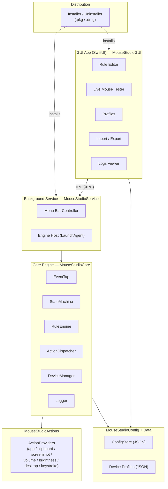

**Key idea:** The GUI never touches mouse events. It only reads/writes configuration and asks the Service for live status (e.g., Live Tester events). The Service hosts the Core engine, which is the only component tapping mouse input.

---

## 3. Module Dependency Diagram

Swift Package targets and their allowed dependencies. A cycle here is a design error.

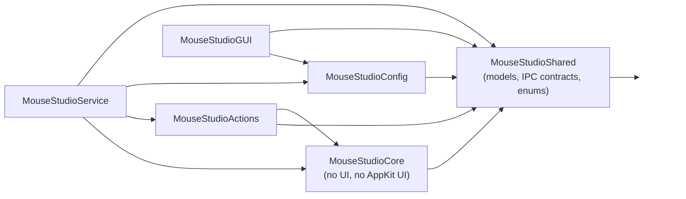

Rules:
- `MouseStudioShared` depends on nothing internal (pure data models + IPC contracts + enums). Both GUI and Core/Service import it, so they agree on types without depending on each other.
- `MouseStudioCore` depends only on `Shared`. **No AppKit UI, no SwiftUI.** It may use CoreGraphics/IOKit for event taps.
- `MouseStudioGUI` depends on `Config` + `Shared` only. It never imports `Core` directly; it reaches the engine through IPC contracts defined in `Shared`.

---

## 4. Folder Responsibilities

```
MouseStudio/
├── Package.swift                      # Swift Package manifest; defines targets above
├── LICENSE                            # MIT
├── README.md
├── docs/
│   ├── TechnicalDesignDocument.md     # this document
│   ├── Architecture.md
│   ├── Configuration.md
│   └── DeveloperGuide.md
├── Sources/
│   ├── MouseStudioShared/             # Pure models, enums, IPC message contracts. Zero internal deps.
│   │   ├── Models/                    # Rule, Trigger, Condition, ActionSpec, Profile, DeviceProfile
│   │   ├── IPC/                        # IPC request/response DTOs + protocol
│   │   └── Enums/                      # ButtonID, GestureKind, ScrollDirection, ...
│   ├── MouseStudioCore/               # The automation engine. Testable, headless.
│   │   ├── Events/                    # EventTap, RawEvent normalization
│   │   ├── State/                     # StateMachine, per-button state, timers
│   │   ├── Rules/                     # RuleEngine, Trigger matching, Condition eval
│   │   ├── Dispatch/                  # ActionDispatcher
│   │   ├── Devices/                   # DeviceManager, DeviceProfile loading, detection/learning mode
│   │   └── Logging/                   # Logger, log ring buffer, perf timing
│   ├── MouseStudioActions/            # Concrete ActionProvider implementations
│   │   ├── AppLaunchProvider.swift
│   │   ├── ClipboardProvider.swift
│   │   ├── ScreenshotProvider.swift
│   │   ├── VolumeProvider.swift
│   │   ├── BrightnessProvider.swift
│   │   ├── DesktopProvider.swift
│   │   └── KeystrokeProvider.swift
│   ├── MouseStudioConfig/             # ConfigStore: read/write/validate JSON; atomic saves; migrations
│   ├── MouseStudioService/            # Background daemon + menu bar; hosts Core; exposes IPC server
│   │   ├── EngineHost.swift
│   │   ├── IPCServer.swift
│   │   └── MenuBarController.swift
│   └── MouseStudioGUI/                # SwiftUI app; IPC client
│       ├── App/                       # MouseStudioApp (entry), AppState
│       ├── Rules/                     # RulesView, RuleEditorView, TriggerPicker, ActionPicker
│       ├── Tester/                    # MouseTesterView, mouse illustration + highlight
│       ├── Profiles/                  # ProfilesView
│       ├── ImportExport/              # ImportExportView
│       └── Logs/                      # LogsView
├── DeviceProfiles/                    # Shipped JSON device profiles
│   ├── generic-3button.json
│   ├── generic-5button.json
│   └── ant-gm100.json
├── Installer/                         # pkgbuild/productbuild scripts, LaunchAgent plist, uninstall.sh
└── Tests/
    ├── CoreTests/                     # StateMachine, RuleEngine, Dispatcher unit tests
    ├── ConfigTests/                   # schema validation, migration tests
    └── IntegrationTests/              # simulated end-to-end via injected events
```

---

## 5. Class Diagrams

### 5.1 Core Engine

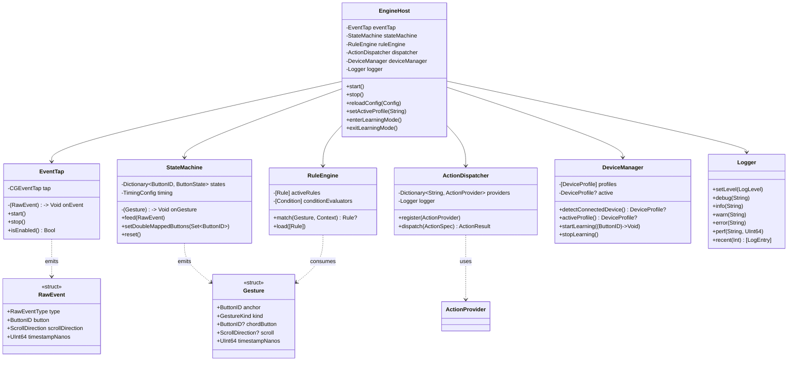

### 5.2 Protocol / Extensibility Layer

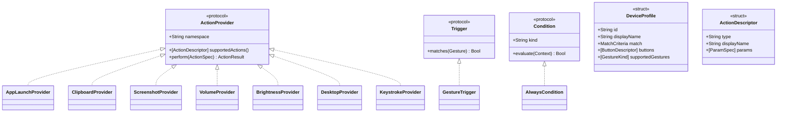

### 5.3 GUI + IPC

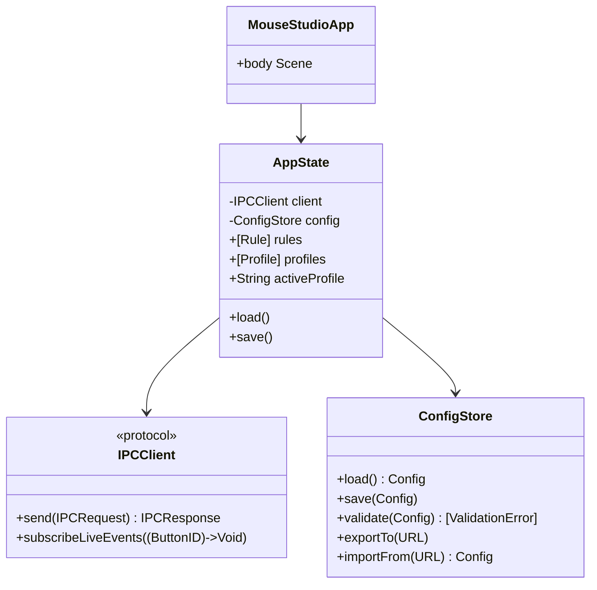

---

## 6. Event Flow Diagrams

### 6.1 Normal automation flow

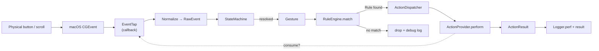

### 6.2 Event suppression decision

The engine must decide whether to swallow the original OS event (e.g., Button4 mapped to an action should not also trigger the app's default "back"). Decision is made in the EventTap callback based on whether the button is mapped in the active profile+rules.

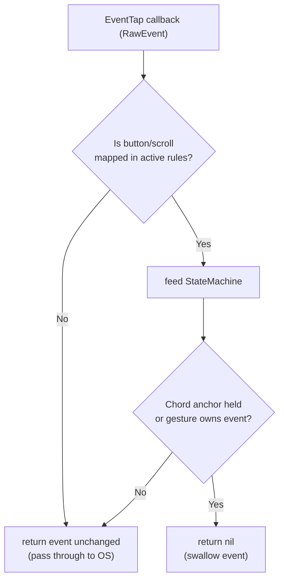

---

## 7. Sequence Diagrams

### 7.1 Double-click resolution → action

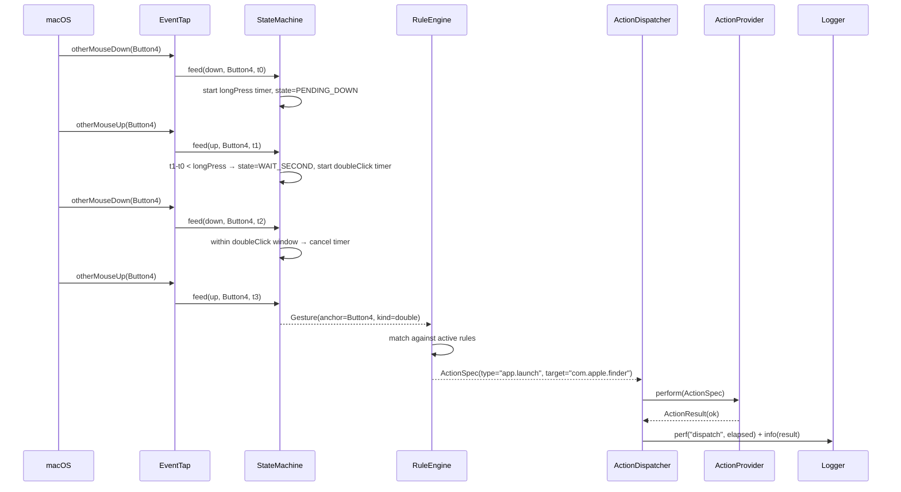

### 7.2 Chord (Button4 + Scroll Up → Volume Up)

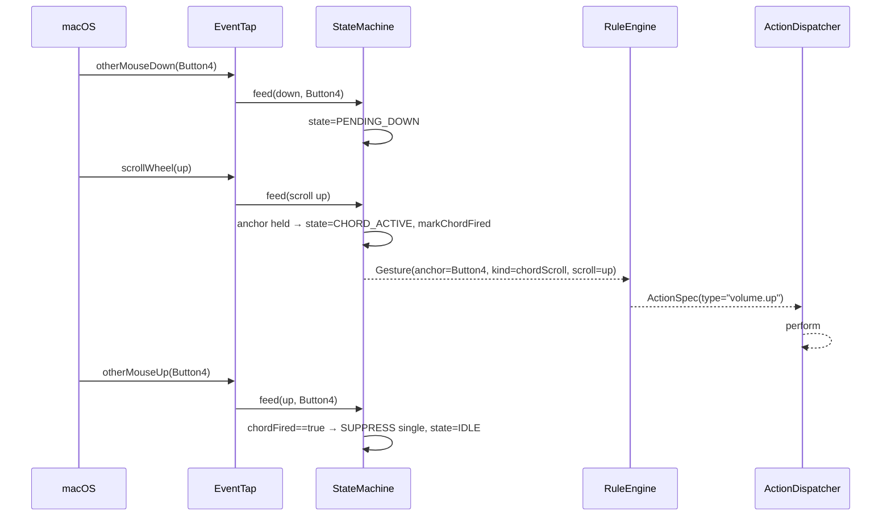

### 7.3 Live Mouse Tester ("Detect Mouse")

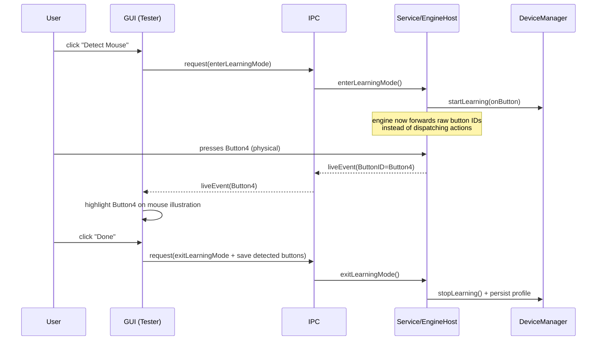

### 7.4 Config change from GUI applied to running engine

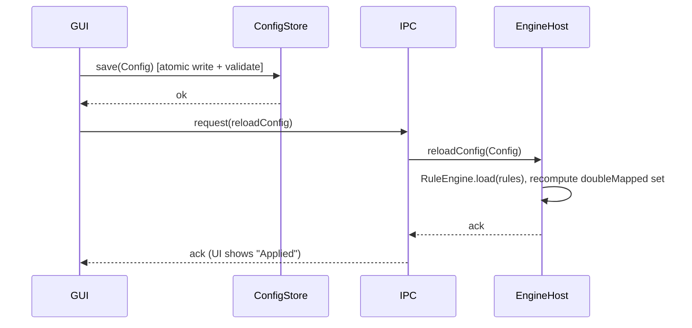

---

## 8. State Machine Diagrams

### 8.1 Per-button state machine (Click + Combination engine)

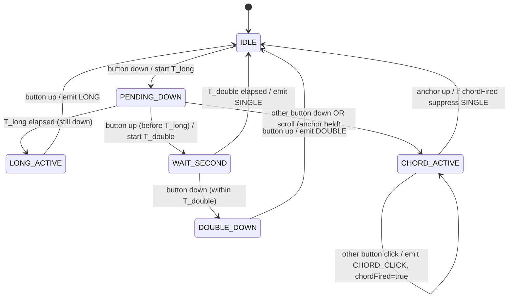

Notes:
- If a button has **no double mapping** in the active rules, `WAIT_SECOND` is skipped and `SINGLE` is emitted immediately on button-up (zero perceived latency). The set of double-mapped buttons is provided by `RuleEngine` after each config load.
- `T_long` (default 350 ms) and `T_double` (default 250 ms) are configurable.
- `chordFired` prevents the anchor's own single-click from firing after a chord.

### 8.2 Engine lifecycle state

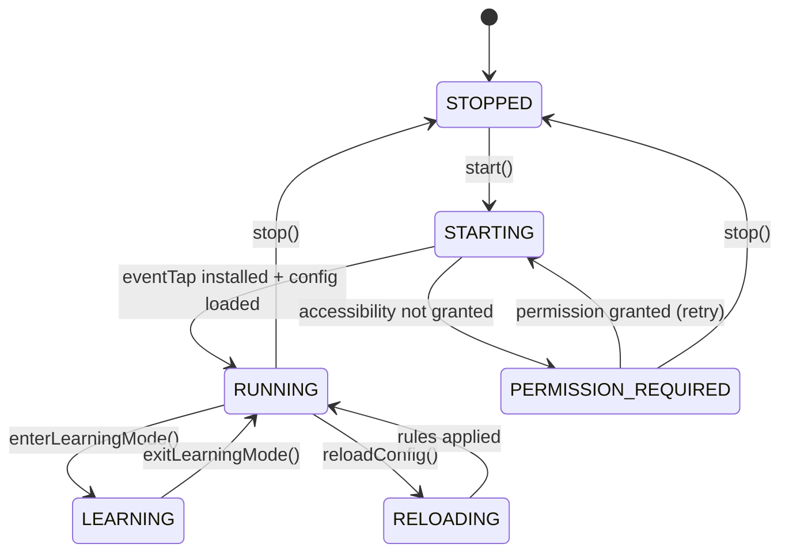

---

## 9. JSON Schema Definitions

All schemas are JSON Schema Draft 2020-12. Stored config is versioned via `schemaVersion` to support migrations.

### 9.1 Config file (`config.json`)

```json
{
  "$schema": "https://json-schema.org/draft/2020-12/schema",
  "title": "MouseStudioConfig",
  "type": "object",
  "required": ["schemaVersion", "activeProfile", "timing", "logging"],
  "properties": {
    "schemaVersion": { "type": "integer", "const": 1 },
    "activeProfile": { "type": "string" },
    "timing": {
      "type": "object",
      "required": ["doubleClickMs", "longPressMs"],
      "properties": {
        "doubleClickMs": { "type": "integer", "minimum": 100, "maximum": 600, "default": 250 },
        "longPressMs":   { "type": "integer", "minimum": 150, "maximum": 1000, "default": 350 }
      }
    },
    "logging": {
      "type": "object",
      "properties": {
        "level": { "enum": ["debug", "info", "warn", "error"], "default": "info" },
        "perf":  { "type": "boolean", "default": false }
      }
    }
  }
}
```

### 9.2 Profile file (`profiles/<name>.json`)

```json
{
  "$schema": "https://json-schema.org/draft/2020-12/schema",
  "title": "Profile",
  "type": "object",
  "required": ["id", "displayName", "rules"],
  "properties": {
    "id": { "type": "string", "pattern": "^[a-z0-9-]+$" },
    "displayName": { "type": "string" },
    "deviceProfile": { "type": "string", "description": "device profile id this profile targets, optional" },
    "rules": {
      "type": "array",
      "items": { "$ref": "#/$defs/rule" }
    }
  },
  "$defs": {
    "rule": {
      "type": "object",
      "required": ["id", "enabled", "trigger", "action"],
      "properties": {
        "id": { "type": "string" },
        "enabled": { "type": "boolean", "default": true },
        "trigger": { "$ref": "#/$defs/trigger" },
        "conditions": {
          "type": "array",
          "items": { "$ref": "#/$defs/condition" },
          "default": []
        },
        "action": { "$ref": "#/$defs/action" }
      }
    },
    "trigger": {
      "type": "object",
      "required": ["button", "gesture"],
      "properties": {
        "button":  { "enum": ["Left", "Right", "Middle", "Button4", "Button5"] },
        "gesture": { "enum": ["single", "double", "long", "chordClick", "chordScrollUp", "chordScrollDown"] },
        "chordWith": { "enum": ["Left", "Right", "Middle", "Button4", "Button5"],
                       "description": "required only for chordClick" }
      }
    },
    "condition": {
      "type": "object",
      "required": ["kind"],
      "properties": {
        "kind": { "type": "string", "description": "e.g. 'always'; per-app conditions added post-MVP" }
      }
    },
    "action": {
      "type": "object",
      "required": ["type"],
      "properties": {
        "type":   { "type": "string", "description": "namespace.name e.g. 'app.launch', 'clipboard.copy'" },
        "params": { "type": "object", "additionalProperties": true, "default": {} }
      }
    }
  }
}
```

### 9.3 Device profile file (`DeviceProfiles/<id>.json`)

```json
{
  "$schema": "https://json-schema.org/draft/2020-12/schema",
  "title": "DeviceProfile",
  "type": "object",
  "required": ["id", "displayName", "match", "buttons", "supportedGestures"],
  "properties": {
    "id": { "type": "string", "pattern": "^[a-z0-9-]+$" },
    "displayName": { "type": "string" },
    "match": {
      "type": "object",
      "description": "how to recognize this device; all present fields must match",
      "properties": {
        "vendorId":  { "type": "integer" },
        "productId": { "type": "integer" },
        "productName": { "type": "string" }
      }
    },
    "buttons": {
      "type": "array",
      "items": {
        "type": "object",
        "required": ["id", "displayName", "detectable"],
        "properties": {
          "id": { "enum": ["Left", "Right", "Middle", "Button4", "Button5"] },
          "displayName": { "type": "string" },
          "detectable": { "type": "boolean", "description": "false = hardware-only (e.g. DPI)" }
        }
      }
    },
    "supportedGestures": {
      "type": "array",
      "items": { "enum": ["single", "double", "long", "chordClick", "chordScrollUp", "chordScrollDown"] }
    }
  }
}
```

### 9.4 Example GM100 device profile (`ant-gm100.json`)

```json
{
  "id": "ant-gm100",
  "displayName": "ANT Esports GM100",
  "match": { "productName": "GM100" },
  "buttons": [
    { "id": "Left",    "displayName": "Left Click",   "detectable": true },
    { "id": "Right",   "displayName": "Right Click",  "detectable": true },
    { "id": "Middle",  "displayName": "Middle Click", "detectable": true },
    { "id": "Button4", "displayName": "Side Back",    "detectable": true },
    { "id": "Button5", "displayName": "Side Forward", "detectable": true }
  ],
  "supportedGestures": ["single", "double", "long", "chordClick", "chordScrollUp", "chordScrollDown"]
}
```

### 9.5 Export bundle format (`*.mousestudio.json`)

Import/Export wraps config + selected profiles in one file:

```json
{
  "schemaVersion": 1,
  "exportedAt": "2026-07-07T00:00:00Z",
  "app": "Mouse Studio",
  "config": { "...": "config.json contents" },
  "profiles": [ { "...": "profile objects" } ]
}
```

---

## 10. API Contracts

### 10.1 Core protocols (Swift signatures)

```swift
// ActionProvider — every action module conforms. This is the future plugin seam.
public protocol ActionProvider {
    /// e.g. "app", "clipboard", "volume"
    var namespace: String { get }
    /// UI metadata used by the GUI action picker (dropdowns).
    func supportedActions() -> [ActionDescriptor]
    /// Execute. MUST NOT throw; return a result. MUST be safe to call on the engine queue.
    func perform(_ spec: ActionSpec) -> ActionResult
}

public struct ActionSpec: Codable, Equatable {
    public let type: String            // "namespace.name", e.g. "app.launch"
    public let params: [String: JSONValue]
}

public enum ActionResult: Equatable {
    case ok
    case ignored(reason: String)       // e.g. unmapped / no-op
    case failed(error: String)         // recoverable; logged, never crashes
}

public struct ActionDescriptor: Codable, Equatable {
    public let type: String            // "app.launch"
    public let displayName: String     // "Launch Application"
    public let params: [ParamSpec]     // drives GUI form fields
}

public struct ParamSpec: Codable, Equatable {
    public enum Kind: String, Codable { case string, appBundleID, integer, bool, enumChoice }
    public let key: String
    public let displayName: String
    public let kind: Kind
    public let choices: [String]?      // for enumChoice
    public let required: Bool
}

// Trigger matching
public protocol Trigger {
    func matches(_ gesture: Gesture) -> Bool
}

// Condition (MVP: only AlwaysCondition; protocol reserved for per-app rules)
public protocol Condition {
    var kind: String { get }
    func evaluate(_ context: EvaluationContext) -> Bool
}

// Device profiles
public protocol DeviceProfileProviding {
    func detectConnectedDevice() -> DeviceProfile?
    func activeProfile() -> DeviceProfile?
}
```

### 10.2 IPC contract (GUI ↔ Service)

Transport: **XPC** (Apple-native, secure, no open network port). Messages are `Codable` DTOs defined in `MouseStudioShared`.

```swift
public enum IPCRequest: Codable {
    case getStatus
    case reloadConfig(Config)
    case setActiveProfile(String)
    case enterLearningMode
    case exitLearningMode
    case getRecentLogs(limit: Int)
    case pauseEngine
    case resumeEngine
}

public enum IPCResponse: Codable {
    case status(EngineStatus)          // running / stopped / permissionRequired / learning
    case ack
    case logs([LogEntry])
    case error(String)
}

// Server pushes async events to subscribed GUI clients:
public enum IPCEvent: Codable {
    case liveButton(ButtonID)          // Live Tester
    case engineStateChanged(EngineStatus)
}
```

Contract rules:
- The Service is the **single writer** of runtime engine state. The GUI is a client.
- All IPC payloads are validated on receipt; malformed messages return `.error` and are logged, never crash the Service.
- `reloadConfig` is idempotent; sending the same config twice is safe.

### 10.3 ConfigStore contract

```swift
public protocol ConfigStoring {
    func load() throws -> Config
    func save(_ config: Config) throws          // atomic: write temp + rename
    func validate(_ config: Config) -> [ValidationError]
    func exportBundle(to url: URL) throws
    func importBundle(from url: URL) throws -> Config
}
```

---

## 11. Threading Model

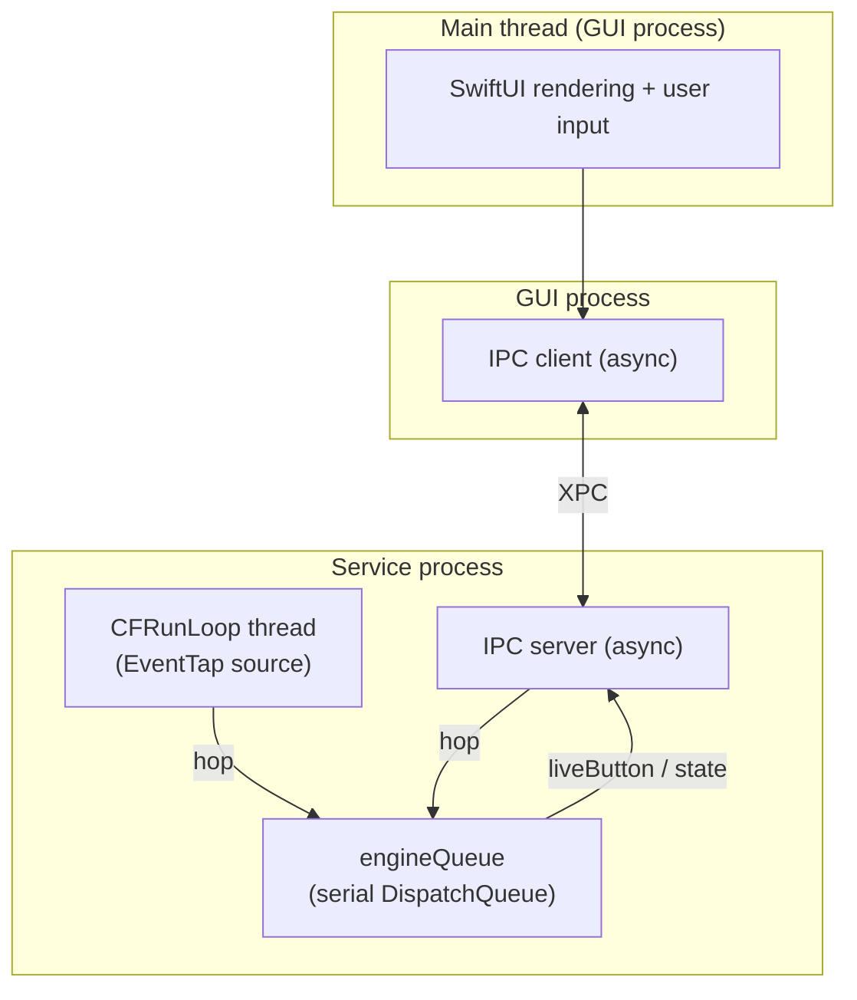

Rules:
- **EventTap** runs on a dedicated thread with a `CFRunLoop` (required by `CGEventTap`). Its callback does the absolute minimum: normalize the `CGEvent` into a `RawEvent`, decide pass/swallow, then hand off. The swallow decision must be synchronous (the callback's return value controls suppression), so the "is this button mapped?" lookup uses an immutable, lock-free snapshot of the active mapping.
- **engineQueue** (a single serial `DispatchQueue`) owns all mutable engine state: StateMachine timers, RuleEngine rules, DeviceManager state. All mutation happens here → no locks needed on hot state.
- **Timers** (`T_long`, `T_double`) are scheduled on `engineQueue` via `DispatchSourceTimer`, so their fire handlers are already on the owning queue.
- **Config reload** publishes a new immutable mapping snapshot; the EventTap thread reads it atomically (via an `os_unfair_lock`-guarded or atomic pointer swap) — never blocks.
- **GUI** does all UI on the main thread; IPC calls are async and never block the UI.
- **ActionProviders** run on `engineQueue`. Actions that must touch AppKit UI (e.g., launching apps) hop to the main thread of the Service process as needed, but the dispatch decision/timing is recorded on `engineQueue`.

Concurrency correctness: the only cross-thread shared data is (a) the active-mapping snapshot (immutable, atomically swapped) and (b) IPC message passing (serialized by XPC). No shared mutable state is accessed from two threads without a hop.

---

## 12. Accessibility Permissions Flow

`CGEventTap` requires **Accessibility** permission (and, for some capture modes, **Input Monitoring**). This is the single biggest first-run UX hurdle.

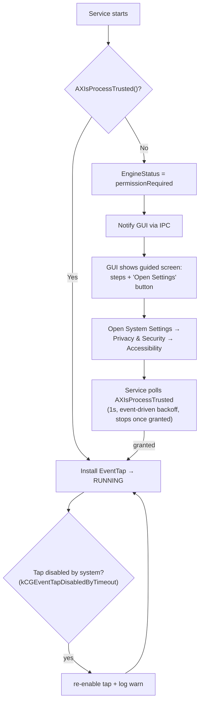

Details:
- Use `AXIsProcessTrustedWithOptions` with the prompt option on first run to trigger the native dialog.
- The GUI provides a clear guided flow with a button that deep-links to the correct Settings pane.
- After granting, macOS may require a relaunch of the Service; the installer/LaunchAgent handles restart.
- Listen for `kCGEventTapDisabledByTimeout` / `kCGEventTapDisabledByUserInput` and re-enable the tap automatically (a common production pitfall).
- The permission poll uses backoff and stops immediately once granted — no permanent polling loop (honors the no-busy-loop rule).

---

## 13. Security Considerations

- **Least privilege:** The GUI does **not** require Accessibility permission; only the Service does. This limits the attack surface of the input-tapping capability to one small, auditable process.
- **No network:** MVP has zero outbound/inbound network. IPC is local **XPC only** — no TCP/HTTP port is opened. This eliminates remote attack vectors by construction.
- **Input tap safety:** The EventTap is a **listen/modify** tap on mouse events only. It must never log keystroke contents. Keystroke *actions* (KeystrokeProvider) only **emit** predefined shortcuts from config; the engine never records typed text.
- **Config integrity:** Config files live under `~/Library/Application Support/MouseStudio/` (user-owned, not world-writable). On load, JSON is schema-validated; unknown/oversized fields are rejected. Imported bundles are validated the same way — an imported file cannot inject executable code, only declarative rules referencing already-registered action types. An action `type` that is not registered is rejected with `ActionResult.ignored`.
- **No arbitrary code execution:** Actions are a closed set of registered providers (MVP). There is no "run shell command" action in MVP; if added later it must be gated behind an explicit, clearly-labeled opt-in because it is a privilege-escalation vector.
- **XPC hardening:** The XPC service validates the connecting client's code signature (same team ID) before accepting requests, preventing other processes from driving the engine.
- **Signing/Notarization:** Distributed builds are Developer ID signed, hardened-runtime enabled, and notarized so Gatekeeper accepts them.
- **Secrets:** No credentials in MVP. Logs are stored locally and must never contain PII or keystroke content.

---

## 14. Performance Considerations

- **Latency budget < 5 ms** for the synchronous dispatch path (gesture resolved → action invoked). Measured via `Logger.perf` around dispatch. The hot path is: dictionary lookup (mapping snapshot) → rule match → provider call — all O(1)/O(small).
- **EventTap callback is minimal:** normalize + pass/swallow decision only. No allocation-heavy work, no logging on the tap thread by default (perf logging is opt-in and buffered).
- **Perceived latency:** only appears on buttons that have **both** single and double mappings (the `T_double` wait). Single-only buttons fire immediately — the StateMachine consults the `doubleMapped` set to skip `WAIT_SECOND`.
- **Zero idle CPU:** no `Timer.scheduledTimer` repeating loops, no polling. Everything is event/callback driven. The only timers are one-shot `DispatchSourceTimer`s created on demand and cancelled on resolution.
- **Memory:** log ring buffer is bounded (e.g., last N=2000 entries). Config and rules are small; the active mapping is precompiled into a flat lookup dictionary at load time (not re-parsed per event).
- **Rule matching precompilation:** on `reloadConfig`, rules are compiled into `[TriggerKey: ActionSpec]` where `TriggerKey` = (button, gesture, chordWith?). Runtime match is a single hash lookup, not a linear scan.

---

## 15. Error Handling Strategy

Principle: **the engine never crashes and never blocks input.**

| Layer | Failure | Handling |
|-------|---------|----------|
| EventTap | tap disabled by system | auto re-enable + warn log |
| EventTap | malformed CGEvent | `normalize` returns nil → dropped |
| StateMachine | unexpected event order | defensive reset to IDLE for that button + debug log |
| RuleEngine | no matching rule | `ActionResult.ignored`, debug log, event passes through |
| Dispatcher | provider throws (backstop) | wrapped so a thrown error becomes `.failed`, logged, engine continues |
| ActionProvider | action fails (e.g., app not found) | returns `.failed(error:)`; never throws to caller |
| ConfigStore | invalid/corrupt JSON | load fails → fall back to last-known-good or ship default; surface error to GUI |
| ConfigStore | save failure (disk full) | atomic write means old config preserved; error surfaced |
| IPC | malformed / unauthorized message | `.error` response, logged, connection kept or dropped, Service survives |
| Permissions | Accessibility revoked at runtime | transition to `permissionRequired`, notify GUI, stop tapping gracefully |

Cross-cutting:
- All action execution is wrapped in a top-level `do/catch` backstop even though the protocol says providers don't throw — belt and suspenders.
- Config uses **last-known-good** semantics: a bad reload does not take down a running engine; it keeps the previous compiled ruleset and reports the error.
- Errors are structured `LogEntry`s (level, subsystem, message, timestamp) visible in the GUI Logs view.

---

## 16. Testing Strategy

### 16.1 Unit tests (`Tests/CoreTests`)
- **StateMachine:** table-driven tests for every transition. Inject `RawEvent`s with synthetic timestamps to deterministically test single vs double vs long vs chord, including edge cases (double just inside/outside window, chord-then-release suppression, single-only fast path).
- **RuleEngine:** compilation correctness, trigger-key uniqueness, no-match → ignored, enabled/disabled filtering, active-profile scoping.
- **ActionDispatcher:** provider registration, namespace routing, `.failed`/`.ignored`/`.ok` propagation, backstop catch.
- **DeviceManager:** device matching precedence (specific profile > generic fallback), learning-mode callback delivery.

### 16.2 Config tests (`Tests/ConfigTests`)
- JSON schema validation (valid + invalid fixtures).
- Round-trip: load → save → load equality.
- Import/export bundle round-trip.
- Migration: schemaVersion upgrade path (reserved for future, tested with a v1→v2 stub).
- Last-known-good fallback on corrupt file.

### 16.3 Integration tests (`Tests/IntegrationTests`)
- Simulated end-to-end: feed a scripted `RawEvent` sequence into `EngineHost` (with EventTap replaced by a test source and ActionProviders replaced by spies), assert the exact `ActionSpec` sequence dispatched and the measured latency.
- Verifies the full StateMachine → RuleEngine → Dispatcher chain without real hardware or permissions.

### 16.4 Event simulation harness
A `SimulatedEventSource` conforming to the same interface as `EventTap` lets tests (and a future GUI "test rule" feature) inject events:
```swift
sim.click(.Button4)                    // expect SINGLE after T_double
sim.doubleClick(.Button4)              // expect DOUBLE
sim.hold(.Button4, ms: 400)            // expect LONG
sim.chordScroll(.Button4, .up)         // expect CHORD_SCROLL_UP
sim.assertDispatched(.init(type: "app.launch", params: ["target": "com.apple.finder"]))
sim.assertLatencyUnder(ms: 5)
```

### 16.5 Manual / QA checklist
- First-run Accessibility permission flow on a clean machine.
- Live Tester correctly highlights each physical button on GM100.
- Tap auto-recovery after `kCGEventTapDisabledByTimeout`.
- Install → configure → reboot → engine auto-starts and applies rules.

### 16.6 Coverage & CI targets
- `MouseStudioCore` target: aim for high unit coverage (state machine and rule engine are the correctness-critical pieces).
- CI runs unit + config + integration tests on every PR (macOS runner). GUI is smoke-tested; hardware-dependent tests are manual.

---

## 17. Extensibility Points (post-MVP)

These are **designed-in seams**, not implemented in MVP. None require touching the Core engine to add later.

| Future feature | Seam already present |
|----------------|----------------------|
| Plugin system | `ActionProvider` protocol + dynamic registration in `ActionDispatcher` |
| Per-app rules | `Condition` protocol + `EvaluationContext` (frontmost app already passable) |
| New devices | drop a new `DeviceProfiles/*.json`; `DeviceManager` matches it |
| New gestures (triple click, Button4+Button5) | `GestureKind` enum + StateMachine states; RuleEngine already keyed by gesture |
| Cloud sync | behind `ConfigStoring` protocol (swap the store implementation) |
| Auto-update | isolated in Service layer; Core unaffected |
| Menu-bar profile quick-switch | already an IPC command (`setActiveProfile`) |

---

## 18. Open Questions

1. **Input Monitoring vs Accessibility:** confirm during Phase 1 spike whether mouse-button capture on Sequoia needs only Accessibility, or also Input Monitoring. This affects the permissions flow copy.
2. **Brightness/Volume control method:** private frameworks vs simulated media keys. MVP plan is to emit the standard system media/brightness key events (public, safe); confirm this is acceptable for reliability.
3. **Desktop switching:** Spaces switching has no clean public API; plan is to emit the Control+Arrow shortcuts (requires the user's Mission Control shortcuts enabled). Acceptable for MVP?
4. **Distribution identity:** do you have (or want to set up) an Apple Developer ID for signing/notarization, or is MVP distributed unsigned for local build only?

---

*End of Technical Design Document v1.0 (MVP).*

---

## 19. UX Enhancements (v1.1 — GUI layer only)

These eight enhancements are **user-experience features**. Seven live entirely in `MouseStudioGUI` + `MouseStudioConfig`. One (Rule Priority) adds a single declarative `priority` field to the schema and a stable sort in `RuleEngine` compilation — **no change to the engine's runtime hot path or module boundaries**. The core architecture (Sections 2–3) is unchanged.

### 19.1 Rule Creation Wizard (beginners)

A guided, multi-step sheet that produces a valid `Rule` without exposing raw JSON.

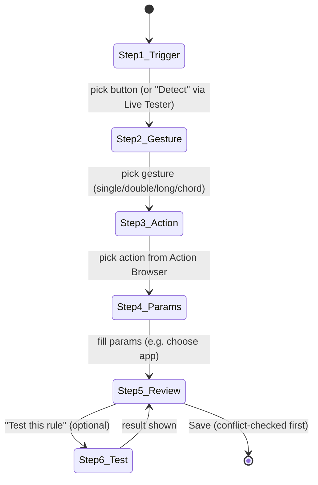

- Each step validates before advancing; the review step shows a plain-language summary ("Double-click Button4 → Launch Finder").
- The wizard reuses the Action Browser (19.2), Conflict Detection (19.3), and Rule Testing (19.4) — it is a composition of existing features, not a parallel code path.
- An "Advanced" toggle drops the user into the full `RuleEditorView` at any point.

### 19.2 Action Browser (categories + search)

A searchable, categorized picker backed by `ActionProvider.supportedActions()` metadata (`ActionDescriptor`). Because it is data-driven, new actions/plugins appear automatically with **no GUI code change**.

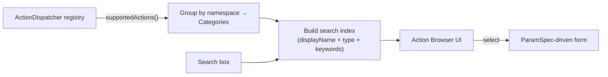

- Categories map to namespaces: App, Clipboard, Screenshot, Volume, Brightness, Desktop, Keystroke.
- Fuzzy search over `displayName`, `type`, and optional `keywords`.
- Selecting an action renders its form from `[ParamSpec]` (e.g., `appBundleID` → app picker; `enumChoice` → dropdown).
- `ActionDescriptor` gains two optional UI fields (metadata only): `category: String?` and `keywords: [String]?`.

### 19.3 Conflict Detection (between rules)

Detects when two enabled rules in the same profile resolve from the same effective trigger key. Runs in `ConfigStore.validate` and live in the editor.

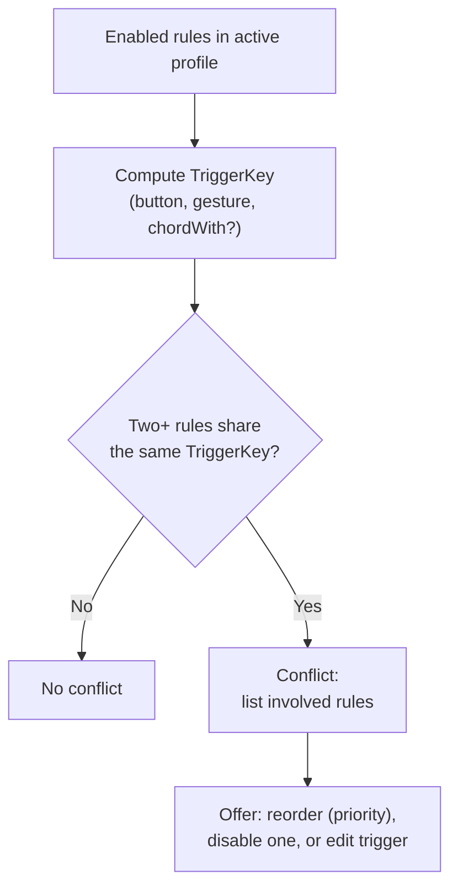

- Conflict is surfaced as a non-blocking warning badge on the rules list and inline in the editor.
- Types detected: **exact duplicate trigger**, and **shadowed rule** (a lower-priority rule that can never win — see 19.7).
- `ConfigStore.validate` returns `ValidationError` entries of kind `.conflict(ruleIDs:)` so both GUI and CI can report them.

### 19.4 Rule Testing before saving

Dry-run a rule against the engine without persisting it, using the `SimulatedEventSource` harness (Section 16.4) exposed over IPC.

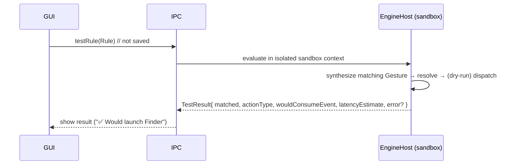

- Adds one IPC request: `case testRule(Rule)` → `case testResult(TestResult)`.
- Test mode can run **simulated** (no real side effect, default) or **live once** (actually perform the action so the user sees it happen) — user choice, clearly labeled.
- The sandbox uses the current active mapping but never mutates saved config.

### 19.5 Backup & Restore

Automatic, timestamped snapshots plus manual export (distinct from user-initiated Import/Export bundles in 9.5).

```
~/Library/Application Support/MouseStudio/
├── config.json
├── profiles/
└── backups/
    ├── 2026-07-07T10-15-00.mousestudio.json
    └── ... (rolling, keep last N=20)
```

- A backup is written automatically **before** every destructive operation (config save, import, restore, bulk delete) — "restore point" semantics.
- `ConfigStore` gains: `func snapshot() throws -> URL`, `func listBackups() -> [BackupInfo]`, `func restore(_ backup: BackupInfo) throws`.
- Restore validates the snapshot against the schema and (on success) writes a fresh backup of the current state first, so restore is itself reversible.
- Rolling retention keeps the last N; older backups are pruned.

### 19.6 Rule Enable / Disable

Already modeled by `rule.enabled` (Section 9.2). UX surface:

- Per-rule toggle in the list (instant; writes config + `reloadConfig`).
- Bulk enable/disable for multi-selection and for an entire profile.
- Disabled rules are excluded from `RuleEngine` compilation, so they cost nothing at runtime and are ignored by Conflict Detection.

### 19.7 Rule Priority resolution

When multiple enabled rules share a `TriggerKey`, priority decides the winner deterministically.

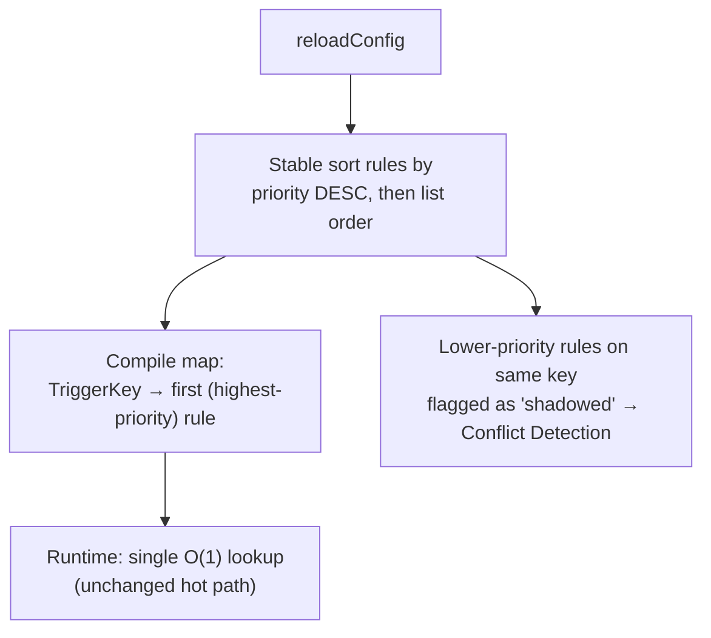

- Schema change (additive, backward-compatible): `rule.priority` — `integer, default 0`. Higher wins. Ties broken by array order (stable).
- **Engine impact is compile-time only.** The runtime lookup remains a single hash lookup; no per-event sorting, so the < 5 ms budget is unaffected.
- The GUI lets users drag to reorder (which maps to priority) and shows which rule "wins" for any conflicting key.

### 19.8 GUI scalability for 1000+ rules

The rules UI must stay responsive with large rule sets.

- **Virtualized list:** SwiftUI `List`/`LazyVStack` renders only visible rows; memory and layout cost are O(visible), not O(total).
- **Indexed search/filter:** rules are indexed on load (by button, gesture, action type, enabled state, profile). Filtering queries the index, not a linear scan.
- **Grouping & sections:** rules grouped by button or by profile with collapsible sections to reduce visible density.
- **Debounced validation:** Conflict Detection recomputes incrementally (only the affected `TriggerKey` group) on edit, debounced (~150 ms), never blocking typing.
- **Paginated/lazy config I/O:** profiles are loaded on demand; the active profile only is compiled into the engine. Import of large bundles streams and validates in a background task with progress.
- **Stable identity:** every `Rule` has a stable `id` used as SwiftUI list identity, avoiding full re-renders on edit.

### 19.9 Summary of contract additions (all additive)

| Area | Addition | Breaks core? |
|------|----------|--------------|
| Schema | `rule.priority: integer = 0` | No (additive, defaulted) |
| Schema | `ActionDescriptor.category`, `.keywords` (optional) | No (metadata only) |
| IPC | `testRule(Rule)` / `testResult(TestResult)` | No (new message) |
| ConfigStore | `snapshot / listBackups / restore` | No (new methods) |
| Validation | `ValidationError.conflict(ruleIDs:)` | No (new case) |
| RuleEngine | stable priority sort at compile time | No (compile-time only; hot path unchanged) |

All runtime data flow, module dependencies, threading, and the < 5 ms dispatch budget from Sections 2–16 remain exactly as specified.

*End of UX Enhancements (v1.1).*
